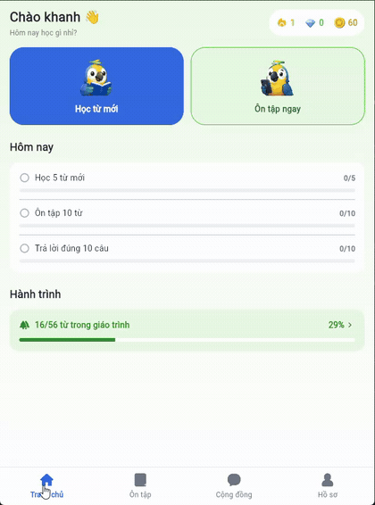
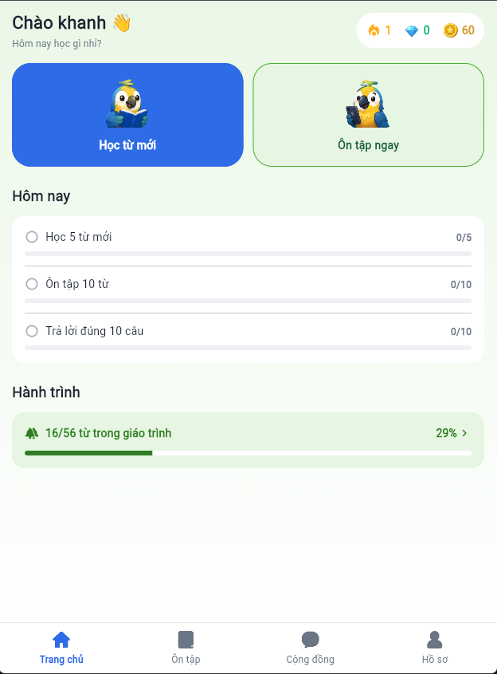
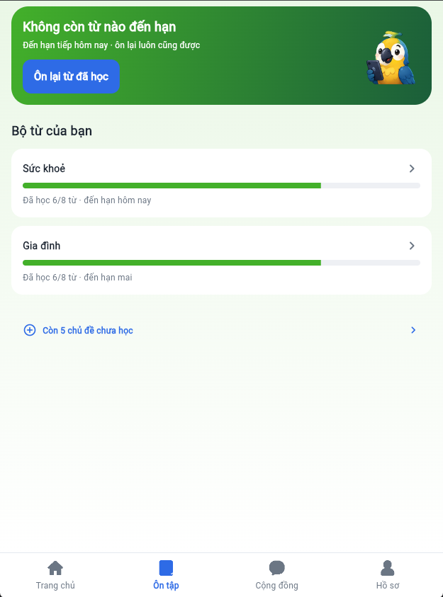
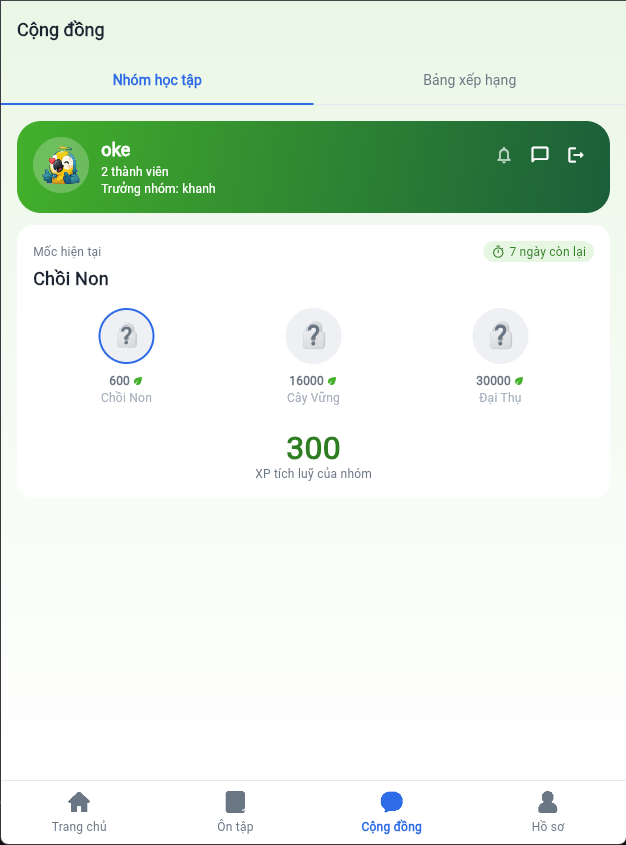
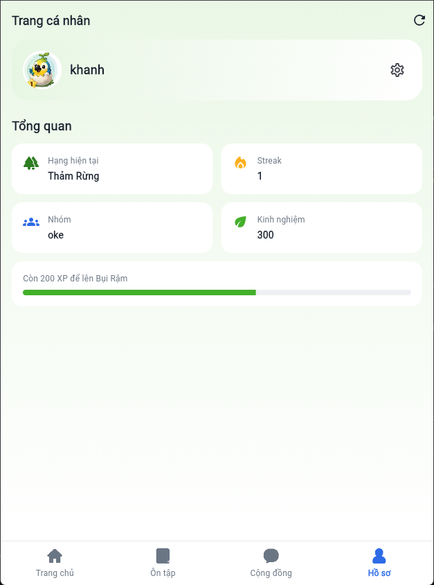

<h1 align="center">Parrot App</h1>

<p align="center">
  App học từ vựng tiếng Anh theo chủ đề, ôn tập bằng thuật toán lặp lại giãn cách
  (SRS), game hoá theo chủ đề <b>rừng rậm</b> với mascot con vẹt.
</p>

<p align="center">
  
</p>


<p align="center">
  
  
  
  
  
</p>

<p align="center">
  <a href="#giao-diện">Giao diện</a> ·
  <a href="#tính-năng">Tính năng</a> ·
  <a href="#cách-chạy">Cách chạy</a> ·
  <a href="#kiến-trúc">Kiến trúc</a> ·
  <a href="#tài-liệu">Tài liệu</a>
</p>

---

## Giao diện

| Trang chủ | Ôn tập | Cộng đồng | Hồ sơ |
|:---:|:---:|:---:|:---:|
|  |  |  |  |
| Lời chào, ví, hai lối học, nhiệm vụ ngày, tiến độ giáo trình | Bộ từ đến hạn ôn, ôn riêng từng chủ đề | Nhóm học tập với 3 mốc cây, bảng xếp hạng | Avatar đổi theo hạng, tổng quan, tiến độ lên hạng |


<p align="center">
  <sub>
    Học từ mới (nối cặp) → chat nhóm với sticker → hồ sơ ·
    <a href="docs/screenshots/demo.mp4">bản MP4 nét hơn</a>
  </sub>
</p>

## Tính năng

| Mảng | Trạng thái |
|---|---|
| Đăng nhập / đăng ký bằng email | ✅ Firebase Auth, chặn route khi chưa đăng nhập |
| Đổi tên hiển thị | ✅ Đồng bộ Auth → Firestore, hiện ở mọi nơi |
| 7 chủ đề × 8 từ (giáo trình dùng chung, admin soạn) | ✅ Firestore |
| Học từ mới: nối cặp + trắc nghiệm | ✅ Sinh từ các từ **chưa học** của chủ đề |
| Ôn tập SRS — mốc `0 · 1 · 3 · 7 · 21 · 60` ngày | ✅ Ôn trộn hoặc ôn riêng từng chủ đề |
| Thưởng XP + hạt, streak, nhiệm vụ ngày | ✅ Ghi cùng một `WriteBatch` với tiến độ |
| Cửa hàng vật phẩm | ✅ Mua bằng `runTransaction`, kiểm số dư ở server |
| 6 hạng theo tầng rừng, avatar đổi theo hạng | ✅ Suy từ XP nên không thể lệch |
| Nhóm học tập: tạo / tham gia / rời | ✅ Số liệu nhóm tính bằng `count()` / `sum()` |
| Chat nhóm | ✅ Firestore realtime (`Stream`) |
| Bảng xếp hạng tuần | ✅ Ghim hàng của mình ở đáy |


## Cách chạy

Dự án trỏ tới một Firebase project riêng, nên **phải tự tạo project của bạn** —
`lib/firebase_options.dart` trong repo không dùng được cho người khác.

<details>
<summary><b>1. Cài công cụ</b></summary>

```bash
npm install -g firebase-tools
firebase login
dart pub global activate flutterfire_cli
```

Windows: thêm `%LOCALAPPDATA%\Pub\Cache\bin` vào PATH rồi **khởi động lại**
VS Code — tiến trình đang chạy không thấy PATH mới.

</details>

<details>
<summary><b>2. Tạo và nối Firebase project</b></summary>

```bash
flutterfire configure --platforms=android,ios,web
```

Trên Firebase Console bật thêm:

- **Authentication** → *Sign-in method* → **Email/Password**
- **Firestore Database** → *Create database* → **production mode**, location
  `asia-southeast1`

</details>

<details>
<summary><b>3. Deploy rules và indexes</b></summary>

```bash
firebase deploy --only firestore:rules,firestore:indexes
```

> [!IMPORTANT]
> Phải deploy **cả indexes**, không chỉ rules. XP nhóm tính bằng aggregate
> `sum()` kèm filter, mà Firestore đòi composite index cho việc đó — thiếu index
> thì tab Nhóm học tập báo lỗi. Index đã khai trong `firestore.indexes.json`.

Rồi nạp dữ liệu mẫu (7 chủ đề, 56 từ, 2 vật phẩm) theo
[docs/SEED_DATA.md](docs/SEED_DATA.md).

</details>

<details>
<summary><b>4. Chạy</b></summary>

```bash
flutter pub get
flutter run
```

Windows cần bật **Developer Mode** (`start ms-settings:developers`) — Flutter
dùng symlink cho plugin native.

> Thêm / đổi tên / xoá file trong `assets/` thì phải **dừng app và chạy lại**.
> Hot reload không sinh lại `AssetManifest`, ảnh mới sẽ không hiện.

</details>

## Kiến trúc

**Feature-first + Clean Architecture rút gọn.** Mỗi feature ba tầng, phụ thuộc
một chiều `presentation → domain ← data`, nên đổi nguồn dữ liệu chỉ sửa `data/`.

```
lib/
├── core/            theme · router · constants · error · providers dùng chung
├── features/        auth · home · quiz · flashcard · vocabulary
│                    community · shop · profile
│   └── <feature>/
│       ├── data/          models (Firestore) · repositories
│       ├── domain/        entities thuần Dart · repository interfaces
│       └── presentation/  providers (Riverpod) · pages · widgets
└── shared/widgets/  widget tái sử dụng giữa nhiều feature
```

**Không có tầng `datasources/`**: ở quy mô này nó chỉ là lớp chuyển tiếp lời gọi,
nên repository chạm `FirebaseFirestore` trực tiếp. Điều cần giữ vẫn giữ —
`presentation` và `domain` không import `cloud_firestore`.

Chi tiết: [docs/ARCHITECTURE.md](docs/ARCHITECTURE.md).

## Mô hình dữ liệu Firestore

```
topics/{topicId}                    name, wordCount, order
topics/{topicId}/words/{wordId}     giáo trình: english, phonetic, vietnamese
shopItems/{itemId}                  vật phẩm cửa hàng
groups/{groupId}                    nhóm học tập
groups/{groupId}/messages/{id}      chat nhóm

users/{uid}                         hồ sơ, XP, hạt, ngọc, streak, groupId
users/{uid}/wordProgress/{wordId}   từ nào đã học + lịch ôn SRS
users/{uid}/topicProgress/{topicId} số từ đã học của từng chủ đề
users/{uid}/dailyStats/{yyyy-MM-dd} nuôi streak và nhiệm vụ hằng ngày
users/{uid}/inventory/{itemId}      vật phẩm đang có
```

Hai thứ dễ lẫn: **giáo trình** (`topics/*/words`, admin soạn, chỉ đọc) ≠ **tiến
độ học** (`wordProgress`, riêng từng người).

Thành viên nhóm là `users/{uid}.groupId`, **không** phải mảng trong document
nhóm — nhờ vậy vào/ra nhóm không cần quyền ghi vào document nhóm, tức không ai
sửa được XP nhóm của người khác.

## Chất lượng

```bash
dart format .      # phải sạch
flutter analyze    # phải 0 issue
flutter test       # 111 test
```

| Số liệu | |
|---|---|
| Dart trong `lib/` | ~11.600 dòng · 125 file |
| Dart trong `test/` | ~1.800 dòng · 111 test |
| `flutter analyze` | 0 issue |

**Chụp ảnh giao diện để xem** (không phải golden test so sánh):

```bash
flutter test --update-goldens --run-skipped --tags preview \
  test/golden_preview_test.dart
```

Ảnh ra `test/preview/*.png`. Công cụ này đã bắt được vài lỗi mà đọc code không
thấy — ví dụ hoạ tiết lá xanh đặt trên thẻ gradient xanh thì hoàn toàn vô hình.

## Tài liệu

| File | Nội dung |
|---|---|
| [docs/ARCHITECTURE.md](docs/ARCHITECTURE.md) | Kiến trúc feature-first, 3 tầng, cách thêm feature mới |
| [docs/UI_SPEC.md](docs/UI_SPEC.md) | Design token, đặc tả từng màn hình, kho ảnh |
| [docs/CODING_GUIDELINES.md](docs/CODING_GUIDELINES.md) | Quy tắc viết code |
| [docs/SEED_DATA.md](docs/SEED_DATA.md) | Dữ liệu cần nạp vào Firestore |
| [docs/PLAN.md](docs/PLAN.md) | Tiến độ và việc còn lại |
| [docs/API_SPEC.md](docs/API_SPEC.md) | Hợp đồng REST API — **không còn dùng**, xem ghi chú cuối |

## Giới hạn đã biết

> [!WARNING]
> **XP gian lận được.** Security rules cho chủ sở hữu ghi hồ sơ của mình, nên
> người dùng sửa trực tiếp `experience` trong Firestore được. Chỉ khắc phục bằng
> **Cloud Functions** (cần gói Blaze) — khoá quyền ghi các field tiền tệ và cộng
> thưởng ở server.

- **Vật phẩm cửa hàng chưa có tác dụng.** Mua thì trừ tiền và tăng số lượng
  thật, nhưng chưa code nào đọc `users/{uid}/inventory` để áp hiệu ứng: XP vẫn
  cộng theo hằng số, streak vẫn chỉ xét `lastActiveDate`.
- **Không có phát âm (TTS).** `SpeakerButton` đã xoá — không màn hình nào dùng
  tới nó, để lại chỉ là mã chết. Làm TTS thì dựng lại nút cùng lúc.

Danh sách đầy đủ: [docs/PLAN.md](docs/PLAN.md).

## Ghi chú về tầng REST

Dự án từng có một tầng gọi REST hoàn chỉnh (`lib/core/network/`, các file
`*_remote_repository.dart`, [docs/API_SPEC.md](docs/API_SPEC.md)) trước khi
chuyển sang Firebase. Phần đó **hiện không dùng** nhưng vẫn giữ trong repo, để
dành cho trường hợp về sau muốn tự dựng backend riêng thay vì phụ thuộc Firebase.
